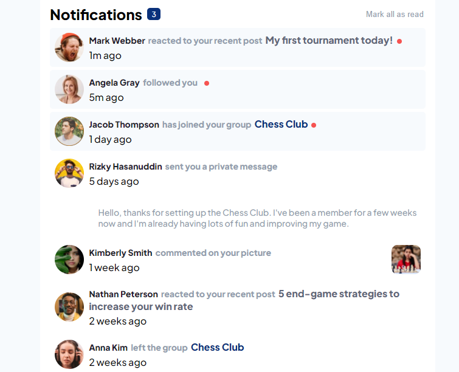

# Frontend Mentor - Notifications page solution

This is a solution to the [Notifications page challenge on Frontend Mentor](https://www.frontendmentor.io/challenges/notifications-page-DqK5QAmKbC). Frontend Mentor challenges help you improve your coding skills by building realistic projects. 

## Table of contents

- [Overview](#overview)
  - [The challenge](#the-challenge)
  - [Screenshot](#screenshot)
  - [Links](#links)
- [My process](#my-process)
  - [Built with](#built-with)
  - [What I learned](#what-i-learned)
  - [Continued development](#continued-development)
  - [Useful resources](#useful-resources)
- [Author](#author)

## Overview

### The challenge

Users should be able to:

- Distinguish between "unread" and "read" notifications
- Select "Mark all as read" to toggle the visual state of the unread notifications and set the number of unread messages to zero
- View the optimal layout for the interface depending on their device's screen size
- See hover and focus states for all interactive elements on the page

### Screenshot

### Links

- Solution URL: [Github](https://github.com/Emmanuel-obiora/notifications-page)
- Live Site URL: [Gh pages](https://emmanuel-obiora.github.io/notifications-page/)

## My process

### Built with

- Semantic HTML5 markup
- CSS custom properties
- Flexbox
- CSS Grid
- [React](https://reactjs.org/) - JS library

### What I learned

This challenge opened my eyes to huge world of possibilities. During the duration of this challenge I have learnt a lot about RESTful API's and to develop and depoloy them both locally and on live server's.

### Continued development

I will continue to learn more on the utilization of restful api's, and also ways to perform CRUD operations. Eventually this will help foster a better integration understanding when working on a full scale project.

### Useful resources

- [Installation and deployment of json-server](https://www.digitalocean.com/community/tutorials/json-server) - This helped me learnt what it meant to create restful API.
- [Deploying json-server on render](https://teckash.hashnode.dev/how-to-deploy-a-json-server-on-render) - This gave me a step by step guide on how to deploy on a live server

## Author

- Website - [Obiora Emmanuel](https://emmanuel-obiora.github.io/portfolio-about-me-/web-content)
- Frontend Mentor - [@Emmanuel-obiora](https://www.frontendmentor.io/profile/Emmanuel-obiora)
- Twitter - [@Miroclesdgenius](https://twitter.com/Miroclesdgenius)
